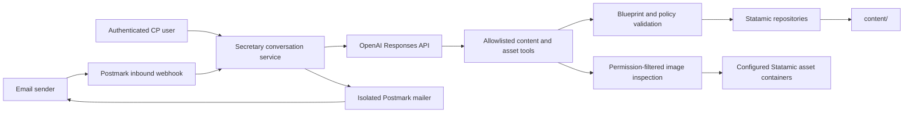

# Architecture

## Product promise

Secretary turns a natural-language request into a reviewable Statamic content change. The same conversation can continue through email or the Control Panel. A draft may be published only after an authenticated user explicitly requests publication.

The model is a planner and writer, not a server operator. It does not receive a shell, PHP execution, arbitrary HTTP access, or direct filesystem access.

## Trust boundaries

Only the `Statamic repositories -> content/` edge may change authored site content. A separate asset pipeline may create a new image in configured Statamic asset containers after authenticated email intake; it cannot replace, rename, edit, or delete assets. Conversation history, webhook idempotency, audit metadata, and proposed change sets live in the application's database and are never exposed as writable tools to the model.

This is a content-target boundary, not a claim that the addon performs no operational persistence. The database stores Secretary state, and Statamic Pro may store working-copy revision metadata in its configured revision repository. The model cannot address either store; only the application-side workflow can use them.

## Content tool surface

Entry work uses six narrow tools:

1. `list_collections` — handles, titles, sites, routes, and available blueprints.
2. `describe_blueprint` — field handles, types, instructions, validation, and safe storage shapes.
3. `search_entries` — bounded metadata search without augmented secrets.
4. `read_entry` — raw entry values plus a content fingerprint.
5. `update_entry_draft` — requires the just-read fingerprint, validates a field-level patch, creates an audit record, and saves a working-copy draft.
6. `create_entry_draft` — creates an unpublished entry that conforms to a real collection and blueprint.

Other content resources use another six typed tools:

1. `list_content_sources` — allowlisted taxonomies, global sets, and navigation handles/sites.
2. `describe_content_schema` — exact term/global/navigation blueprint and tree constraints.
3. `search_content_resources` — bounded term, global-set, and navigation discovery.
4. `read_content_resource` — an exact localized resource and content fingerprint.
5. `update_content_draft` — requires the just-read fingerprint and stages a validated term/global/navigation change without writing live content.
6. `create_term_draft` — stages a new validated term without creating its content file.

Publication is deliberately not an OpenAI tool. A separate application path accepts only a CP publish-button action or a narrowly matched immediate command, then independently verifies Secretary permission, the native resource policy, change-set state, and the unchanged content fingerprint.

There is deliberately no `write_file`, `delete_file`, `run_command`, `edit_blueprint`, `edit_config`, or generic HTTP tool.

Asset work uses three narrow read tools:

1. `list_asset_containers` — only configured containers the requesting user may view.
2. `search_assets` — bounded metadata search over supported image assets.
3. `inspect_assets` — low-detail visual input for exact IDs returned by search or imported from the current email.

The model cannot upload an arbitrary file. The application independently validates authenticated email attachments as JPEG, PNG, or WebP, verifies declared length, actual image type, dimensions, count, total bytes, and relay checksum, then imports through Statamic's upload API. Paths include the full SHA-256 digest, so retries reuse identical bytes and never overwrite a different file.

## Draft and publication model

Secretary maintains an auditable change set with `before`, `patch`, `after`, and `base_fingerprint` values. Applying a proposed update uses optimistic locking so a human edit made after the proposal cannot be overwritten silently.

For a published entry, native draft behavior relies on Statamic Pro Revisions. Saving the changed entry creates or updates its working copy while leaving the live entry untouched. Publishing uses Statamic's revision workflow.

Taxonomy terms, global variables, and navigation trees do not have equivalent working-copy revisions. Secretary therefore validates their proposed `after` state and stores it only in the addon database. Explicit publication re-reads the live resource, rejects fingerprint conflicts, revalidates the patch and native policy, checks the destination path, and only then saves through Statamic's repository.

If revisions are unavailable:

- Secretary may safely create a new unpublished entry.
- Secretary must not turn an existing published entry into a draft, because that would remove the live page.
- Updates to published entries remain proposals and cannot be applied until revisions are enabled. A future release may offer an isolated preview workspace, but it must not weaken this rule.

## Authorization

Control Panel requests run as the signed-in Statamic user and must pass both Secretary permissions and the native entry policy for the target collection/site. Suggested permissions:

- `access secretary`
- `use secretary`
- `publish with secretary`
- `configure secretary`

Email requests are accepted only from senders mapped to Statamic users with `use secretary`; an optional environment allowlist can narrow that set further. Postmark's generated SpamAssassin signals must report an author-domain DKIM pass by default, and high-scoring spam is rejected. A generic SPF pass is not treated as identity proof because it authenticates the envelope sender rather than necessarily aligning with the visible `From` address. Publishing by email is separately opt-in and always requires an authenticated sender. The inbound webhook itself is protected with HTTPS and Postmark HTTP Basic Authentication derived from `APP_KEY`. Provider message IDs are unique idempotency keys.

Postmark onboarding uses the environment-backed Server API Token to read `/server`, retrieve only the inbound address and non-secret server metadata, and update `InboundHookUrl`. The token never enters addon settings or browser props. Secretary stores the selected public sender address and discovered inbound routing metadata in an encrypted database setting. Its named Postmark mailer carries the token directly and does not modify the site's default Laravel mailer.

Each installation can use its own inbound route and public mailbox. For the optional shared `secretary@statamic.no` address, the addon includes a disabled-by-default signed inbound endpoint, signed reply client, and one-code CP pairing flow. They bind every message to one installation, route, sender, and conversation, verify an exact-body HMAC inside a short clock window, and atomically reject replayed nonces before the normal permission and content workflow runs. The separately packaged `relay/` service deterministically resolves an opaque alias—or one exact unambiguous sender match—to one installation, signs delivery, and binds outbound Postmark replies back to the original route, conversation, inbound message, and recipient. It has no model access. Its encrypted SQLite storage, authenticated HTTP endpoints, retry-safe one-time pairing, redacted operator commands, two-phase signing-secret rotation, pending/current/retired route rotation, hashed cross-worker rate limits, and secret-free security events are implemented. Retired routes reject new threads but retain exact existing conversation bindings. Deployment, customer-facing code issuance and controls, remaining operational hardening, and the live two-site proof remain separate hosted work. The full contract is specified in [shared-address-relay.md](shared-address-relay.md).

## Conversation flow

1. Store the incoming message, enqueue it durably, and acknowledge the HTTP request quickly. A `sync` queue defers local processing until after the response; production queue drivers receive the job before the response is returned.
2. Resolve or create a conversation using the CP conversation ID or Postmark mailbox hash.
3. Give the model only the current request, relevant conversation state, compact content schema, and allowlisted tools.
4. Execute read tools immediately. Store mutation tools as audited change sets and validate them in application code.
5. Apply an entry working copy when safe; keep other resource drafts database-staged.
6. Persist exactly one reply per inbound message, then return a concise summary, field-level diff, warnings, and review/preview links. Email replies combine plus-address thread routing with validated RFC threading headers. CP pages poll only while work is pending.
7. Publish only when the latest user message explicitly requests it and the target change set is unchanged and publishable.

Each inbound message may create at most one change set for a given resource and operation identity. If a worker or model continuation repeats that mutation with different generated arguments after a partial success, Secretary returns the first auditable change instead of creating a divergent second draft.

Jobs from CP and email share a per-conversation cache lock and defer newer messages until older inbound messages are processed. This keeps OpenAI continuation IDs and content mutations ordered even with multiple workers. A fixed retry deadline of at least 24 hours prevents normal FIFO deferrals from consuming a short attempt budget; actual exceptions remain separately bounded. Production requires a shared lock-capable cache and a queue `retry_after` longer than the configured Secretary job timeout.

## Model and API

The OpenAI model is configurable. The initial default follows the product brief (`gpt-5.5`), while installations can select a newer compatible model after evaluation. The integration uses the Responses API with strict function schemas, disables parallel tool calls so inspect/read results precede mutations, and preserves response/tool items across turns.

The API key remains in environment configuration. It is never stored in content or returned to the browser. Requests include a site-scoped HMAC safety identifier derived from the authenticated CP user or allowed sender; neither the raw identity nor the application key is sent. Stored mode continues with `previous_response_id`; stateless mode requests encrypted reasoning content and replays the complete response/tool sequence locally.

## Marketplace shape

The repository is a standalone `statamic-addon` Composer package with a Statamic addon service provider. Before Marketplace submission it will need:

- tagged semantic releases on GitHub;
- a Packagist package;
- installation, privacy, security, queue, Postmark, and OpenAI setup documentation;
- a compatibility and support policy;
- automated tests across supported PHP/Laravel versions;
- screenshots and a polished Marketplace listing;
- a seller account, and billing setup if the addon is paid.

## Deliberate limits

- Asset files and metadata are excluded because their normal storage location may be outside `content/`.
- No blueprint, fieldset, template, route, config, or code edits.
- No deletion tools.
- No remote web research from the production agent.
- No silent conflict resolution.
- No publication based solely on model interpretation without an application-side authorization check.
